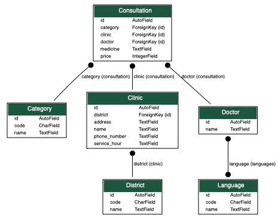

# Necktie Doctor Django Application

## Entity Relationship Diagram


## Get Started

### 1. Create sqlite database
```shell script
python manage.py migrate
```

### 2. Run tests
```shell script
python manage.py test
```

### 3. Run application
```shell script
python manage.py runserver
```

### 4. Test APIs

- List all doctors
  
  http://127.0.0.1:8000/doctor/

- List all doctors with filters

  http://127.0.0.1:8000/doctor?district=tuen-mun&price_range=119,121

- Search a doctor by ID
  
  http://127.0.0.1:8000/doctor/2

## Utils

### Generate ER Diagram
```shell script
python manage.py graph_models -a > erd.dot
dot -Tpng erd.dot -o erd.png
```

### Generate requirements.txt
```shell script
pip freeze > requirements.txt
```
